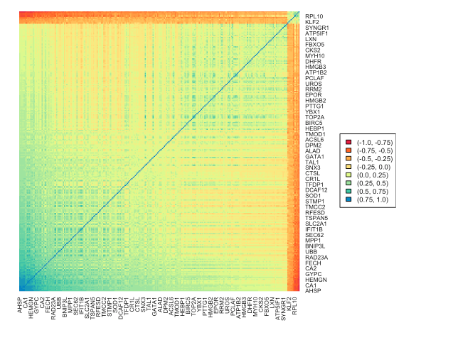

# Multimodal Single Cell RNA Sequencing

This project involves the analysis of the data obtained from multimodal single cell RNA sequencing (scRNA-seq), particularly from human bone marrow donors, where the majority of collected cells are immune cells.


The primary goal is to predict surface protein signals based on gene expression data. This prediction is vital for most publicly available datasets where only RNA count matrices are available, as it aids in identifying and categorizing cells within the sample.

<p align="center">
  
  <i>Heatmap of correlation between the expression of selected genes</i>
</p>

## Data
Multimodal scRNA-seq provides two types of reads for each cell:

* RNA transcript counts reflecting gene expression (marked as X),
* Quantification of surface proteins, directly linked to cell types (marked as y).

## Project structure
The code is provided in the file ```RNA-seq.Rmd```, while the final output with the results of individual stages, including plots and tables generated from the R code – in the file ```RNA-seq.html```.

##
The project is a final task in statistical data analysis.
